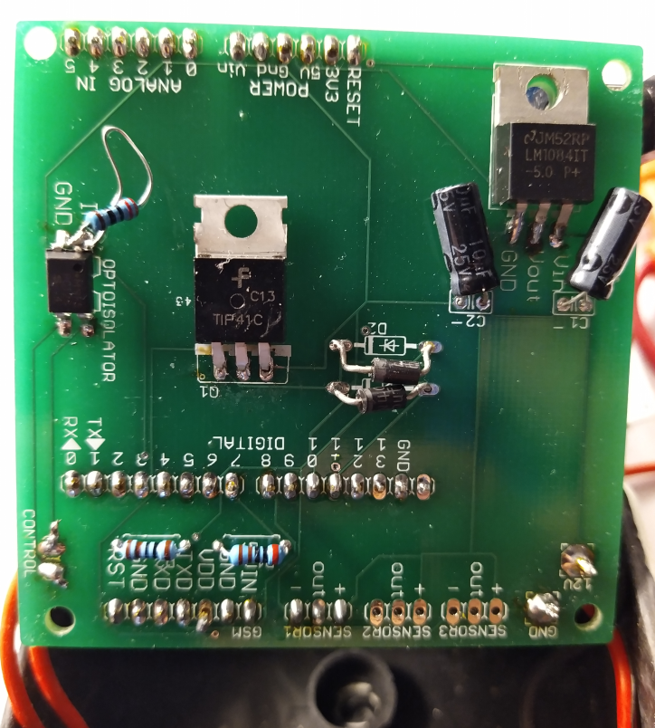
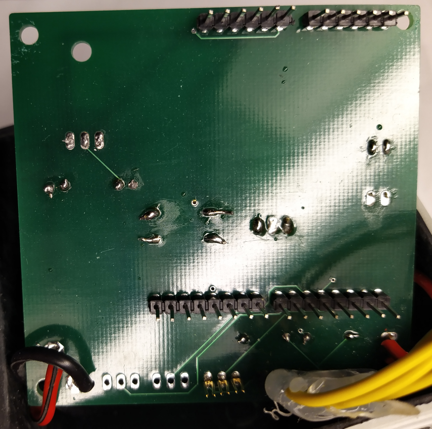
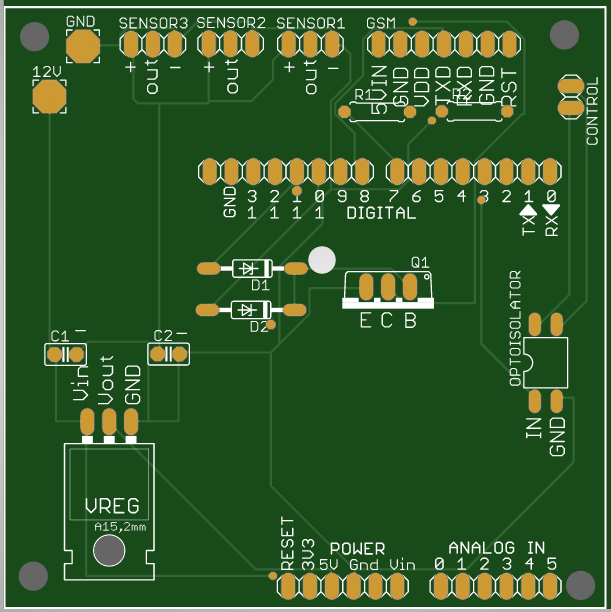
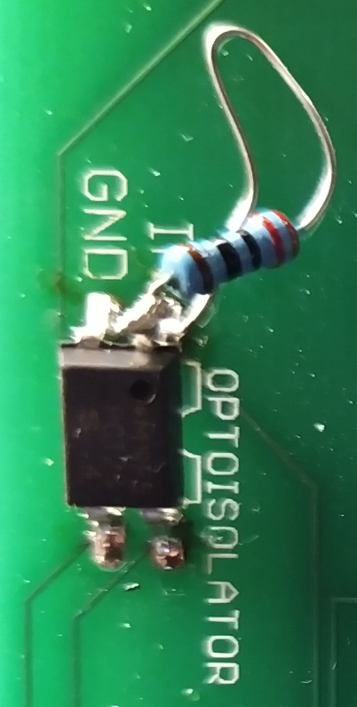
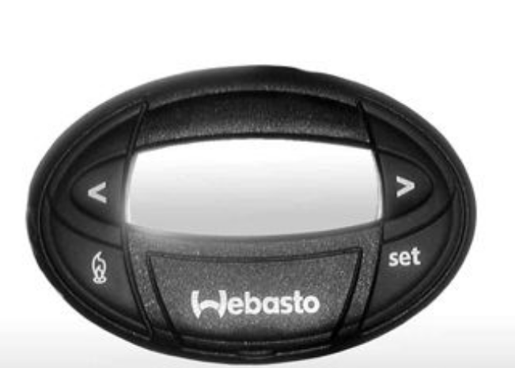
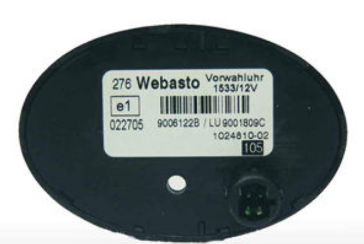

# arduino-webasto-gsm
This repository is for the project that contains gerber files and c code for system that is remotely controlling Webasto clock switch

## Copyright under:
```
  ----------------------------------------------------------------------------
  "THE BEER-WARE LICENSE" (Revision 42):
  salmin36@gmail.com wrote this file.  As long as you retain this notice you
  can do whatever you want with this stuff. If we meet some day, and you think
  this stuff is worth it, you can buy me a beer in return.  Pasi Salminen 
  ----------------------------------------------------------------------------
```
## Disclaimer, Use at your own risk
```
Any action you take upon the information on this Github repository is strictly at your own risk and I am not to be liable for any losses and damages in connection with the use of this information.
```

## Prerequisites
You have to know how to solder and know a little bit of electronics. 


## Arduino Shield
This project has working PCB and code for communicating between mobile phone and this component.
It is used to remotely control Webasto heater and to get the tempereature inside a car.

## Components
Here we have actual prototype pcb:s and a photo from gerber file.

Circuit board has:
- Voltage regulator (LM10841T-5.0) with capacitors (10uF)
- Transistor (TIP41C)
- Diodes 
- Optocoupler (PC123)
- Some resistor (1k & 2k)

Supporting components:
- Sim800 gsm module
- sim card
- DHT11 humidity and temperature sensor
- some extra wires

The 2 resistors are as voltage divider circuit to lover the output voltage 5V of Tx from Arduino to SIM800 Rx port. That communication has to be lowered to allowed range to the SIM800. Sim800 is using 3.4V voltage. When signal comes from SIM800 to arduino that still works becouse 3.4V is determined to be logical 1 inside Arduino.






Optocoupler has a resistor added to the pin becouse I mistakely did not add it to the pcb. If this is not added then when you apply voltage from arduino it fries up the arduinos I/0-pin becouse it does not have a resistor to restrict the flow of current. 



Communication with DHT temperature sensor happens via DHT arduino library. https://www.arduino.cc/reference/en/libraries/dht-sensor-library/


## How it works
Arduino starts up the SIM800 gsm module via transistor. Transistor is conneted via 2 diodes. This is becouse only one i/o pin driving the transistor is not giving enought controlling current for allowing enought current to flow trought SIM800 module. Using digital pins 11 & 10 and going trought diodes it allowes more controlling current to transistor that makes the transistor to provide more current to sim800 module.
<br><br>

After starting up the sim800 module we are reading all the new text messages. If there is new text messages we go trought the payloads. If the paylods contain either "temp" or "on" strings.

<br><br>
If the string is "on" then we put current trought the optocoupler via digital pin 4 for 1 second. Pins from optocoupler that are connected togeather are going behind Webasto oval timer and are soldered into webasto ON-button. <br>
 
<br>
After that we read the humidity and temperature values from digital pin 3 from DHT11 sensor.
After that we send text message to the number with <br><t>"Humidity: xx% Temperature: yy Arduino: on "
<br><br>
If the string is "temp" then we just read temperature and humidty and send message with corresponding values.

<br>
Last thing is that we are cutting off the current from SIM800 module and stopping it. 
<br>


## Future development
There is 3 slots available for 3 pin sensor used with DHT library.
One could add all kinds of fun sensor into this one.
<br>

What comes to the pcb itself. It is taken exactly from arduino Leonard board so it could be shrunk down a quite a bit. 

Also the connection from arduino digital 4 pin to optocoupler should have a place for resistor in order to keep the arduino board not to be fried every time one applies currento to this pin.

The place where the other 2 pins from the other side of optocoupler goes are the pins behind the webasto oval controllers webasto on switch.
So it actually is now soldered on the oval controller itself.

If the size of the box and the ciruit board would smaller and one would make 3d model out of the connector behing the webasto controller it could be just plugged in and no soldering would be required.
<br><br>
In this case it would be good to have some push buttons added and also a small screen.

